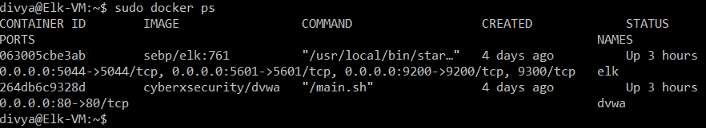

## Automated ELK Stack Deployment

The files in this repository were used to configure the network depicted below.

!https://github.com/divyapursley/ELK-stack/blob/main/diagram/diagram.png(diagram/diagram_.png)

These files have been tested and used to generate a live ELK deployment on Azure. They can be used to either recreate the entire deployment pictured above. Alternatively, select portions of the YAML file may be used to install only certain pieces of it, such as Filebeat.

  - filebeat-config.yml

This document contains the following details:
- Description of the Topology
- Access Policies
- ELK Configuration
  - Beats in Use
  - Machines Being Monitored
- How to Use the Ansible Build

### Description of the Topology

The main purpose of this network is to expose a load-balanced and monitored instance of DVWA, the D*mn Vulnerable Web Application.

Load balancing ensures that the application will be highly available, in addition to restricting access to the network.

What aspect of security do load balancers protect? What is the advantage of a jump box?
- Load balancer sits between the clients and the servers,it can enhance the user experience by providing additional security, performance, resilience and simplify scaling your website. Jump box provide a segregation layer between the target network and the user.

Integrating an ELK server allows users to easily monitor the vulnerable VMs for changes to the host and system configurations.

-What does Filebeat watch for?
 -It helps you keep the simple things simple by offering a lightweight way to forward and centralize logs and files.

-What does Metricbeat record?
 -It is a lightweight way to send system and service statistics. And also collect metrics from your systems and services such as uptime. 

The configuration details of each machine may be found below.

| Name     | Function | IP Address | Operating System |
|----------|----------|------------|------------------|
| Jump Box | 10.1.0.1 | 10.1.0.4   | Ubuntu 18.04     |
| Web-1    | 10.1.0.1 | 10.1.0.5   | Ubuntu 18.04     |
| Web-2    | 10.1.0.1 | 10.1.0.6   | Ubuntu 18.04     |
| Web-3    | 10.1.0.1 | 10.1.0.8   | Ubuntu 18.04     |
| Elk-vm   | 10.0.0.0 | 10.0.0.4   | Ubuntu 18.04     |

### Access Policies

The machines on the internal network are not exposed to the public Internet. 
Only the Jump box host machine can accept connections from the Internet. Access to this machine is only allowed from the following IP addresses:

Jumpbox can be access via SSH Port 22 from personal IP:
 - 89.187.187.162

Elk Stack Server is accessible via Port 5601 uaind the host machine IP:
- 89.187.187.162

Elk Stack Server can be reachd only via SSH from jumpbox using private IP:
- SSH divya@10.0.0.4

Machines within the network can only be accessed by:
Which machine did you allow to access your ELK VM? What was its IP address?
- Jump box  Private IP address: 10.1.0.4
- SSH Port 22 is the only machine that is allowed to access the ELK.

A summary of the access policies in place can be found in the table below.

| Name     | Publicly Accessible | Allowed IP Addresses |
|----------|---------------------|----------------------|
| Jump Box | Yes                 | 89.187.187.162       |
| Web-1    | No                  | 10.1.0.4             |
| Web-2    | No                  | 10.1.0.4             |
| Web-3    | No                  | 10.1.0.4             |
| Elk-VM   | No                  | 10.1.0.4             |

### Elk Configuration 

Ansible was used to automate configuration of the ELK machine. No configuration was performed manually, which is advantageous because...

What is the main advantage of automating configuration with Ansible?
- Ansible can with platform, configuration management, application deployment, intra-service orchestration and provisioning. 

 1.It can manage the infrastructure, networks, operating systems and services that you are already using.
 2.No extra software on your servers means more resources for your applications.
 3.Ansible provides Orchestration in the sense of aligning the business request with the applications, data, and infrastructure.
 4.Ansible has powerful features that can enable you to model even the most complex IT workflows.
 5.Ansible uses a simple syntax written in YAML, called playbooks.

The playbook implements the following tasks:
- In 3-5 bullets, explain the steps of the ELK installation play. E.g., install Docker; download image; etc.

1. creata a new vNEt in resource group
2. create a Peer network connection
3. create  a new VM
     (RAM 4GB+)
     Machines that will work are:
     - Standard D2s v3 (2 vcpus, 8GiB memory)
		 - Standard B2s (2vcpus, 4GiB memory
     
     - Open terminal on your computer and SSH into JUmp box
      Use `cat` to retrieve your _public_ ssh key (~/.ssh/id_rsa.pub) 

     - From Ansible container, SSH into the new VM's using internal IP
      
4. Download Elk and configure a container (elk-docker)
     - create a playbook that installs docker and container
     - launch the playbook
     - You must add the list of machines Ansible can discover and connect.
     `ansible_python_interpreter=/usr/bin/python3`

      - The`hosts` text file should be like this:
   `# /etc/ansible/hosts`
     `[webservers]`
   `10.0.0.4 ansible_python_interpreter=/usr/bin/python3`
  `10.0.0.5 ansible_python_interpreter=/usr/bin/python3`
 ` 10.0.0.6 ansible_python_interpreter=/usr/bin/python3`
​
 `[elk]`
 `10.1.0.4 ansible_python_interpreter=/usr/bin/python3`
	 
  
  - Edit the inventory file `nano /etc/ansible/hosts`.

- Create a new playbook: 
     `touch /etc/ansible/install-elk.yml`
     
- Write `tasks` that do the following:
  Set the `vm.max_map_count` to `262144`

- Install `apt` packages
   - `docker.io`
   - `python3-pip`
    
5. Launch (elk-docker) and start the Elk server

For Documentations:
Azure vNet Documentation
`https://portal.azure.com/#@khiatanidivyafgmail.onmicrosoft.com/resource/subscriptions/8bd35161-7bc9-4784-b6e8-fa83d994f4dd/resourceGroups/Cybersecurity/providers/Microsoft.Network/virtualNetworks/Elk-Net/overview`

Azure new VM 
`https://portal.azure.com/#blade/HubsExtension/BrowseResourceBlade/resourceType/Microsoft.Compute%2FVirtualMachines`

Ansible modulels
`https://docs.ansible.com/ansible/latest/modules/sysctl_module.html`

The following screenshot displays the result of running `docker ps` after successfully configuring the ELK instance.

### Target Machines & Beats
This ELK server is configured to monitor the following machines:
- ELK VM 10.0.0.4

We have installed the following Beats on these machines:
Specify which Beats you successfully installed

- filebeat
https://gist.githubusercontent.com/slape/5cc350109583af6cbe577bbcc0710c93/raw/eca603b72586fbe148c11f9c87bf96a63cb25760/Filebeat

- metricbeat 
https://artifacts.elastic.co/downloads/beats/metricbeat/metricbeat-7.6.1-amd64.deb

These Beats allow us to collect the following information from each machine:
In 1-2 sentences, explain what kind of data each beat collects, and provide 1 example of what you expect to see. E.g., `Winlogbeat` collects Windows logs, which we use to track user logon events, etc._

- Filebeat forwards and centralized logs and files. It also records the system logs, such as syslogs, SSH login attempts, and sudo command by user.

- Metricbeat collectd metrics from system and services. It record the CPU and memory usage of the 3 DVWA containers that we used on ELK stack.

### Using the Playbook
In order to use the playbook, you will need to have an Ansible control node already configured. Assuming you have such a control node provisioned: 

SSH into the control node and follow the steps below:
- Connect to your jump box, and connect to the Ansible container in the box.
   - `ssh divya@10.1.0.4`
   - sudo `docker container list -a`
   - Start the docker using `sudo docker start (container name)`
       ex. `sudo docker start busy_nobel`
   - Get a shell in your container using `sudo docker attach busy_nobel`
   - Create the YAML playbook file to use for configuration `nano /etc/ansible/myfirstplaybook.yml`
   - Install `docker.io` and `python3-pip`
   - Then run the playbook using `ansible-playbook /etc/ansible/myfirstplaybook.yml`
   - Test DVWA by running on th new VM, SSH to the new VM
   - Run `curl localhost/setup.php` to test the connection  

- Answer the following questions to fill in the blanks:
- Which file is the playbook? Where do you copy it?
    - /etc/ansible/files
    - /etc/ansible/files/filebeat-config.yml
    - /etc/ansible/files/metricbeat-config.yml

- Which file do you update to make Ansible run the playbook on a specific machine? How do I specify which machine to install the ELK server on versus which to install Filebeat on?
    - Run `nano/etc/ansible/hosts` and add new IP of the new VM
    - Test ansible config by using ` ansible all -m ping`

  To specify which machine to install Elk server vs Filebeat:
    - Elk server playbook install should have ` hosts: elkservers`
    - Elk server also must hvae `remote_user: elk`
 while Filebeat have:
    - will only have `remote_user` option

- Which URL do you navigate to in order to check that the ELK server is running?
   - Get the public IP address of ELK server listed on Azure
   - Using this syntax, we can access the kibana through our browser 
     http:/52.171.58.59:5601/app/kibana

As a **Bonus**, provide the specific commands the user will need to run to download the playbook, update the files, etc.

Example:
Run `nano my-playbook.yml` to create your YAML file.

to download the playbook
`ansible-playbook filebeat-playbook.yml`

create playbook
`touch /etc/ansible/filebeat.yml`

update the config files
`nano filebeat-config.yml`

update playbook
`nano filebeat.yml`
